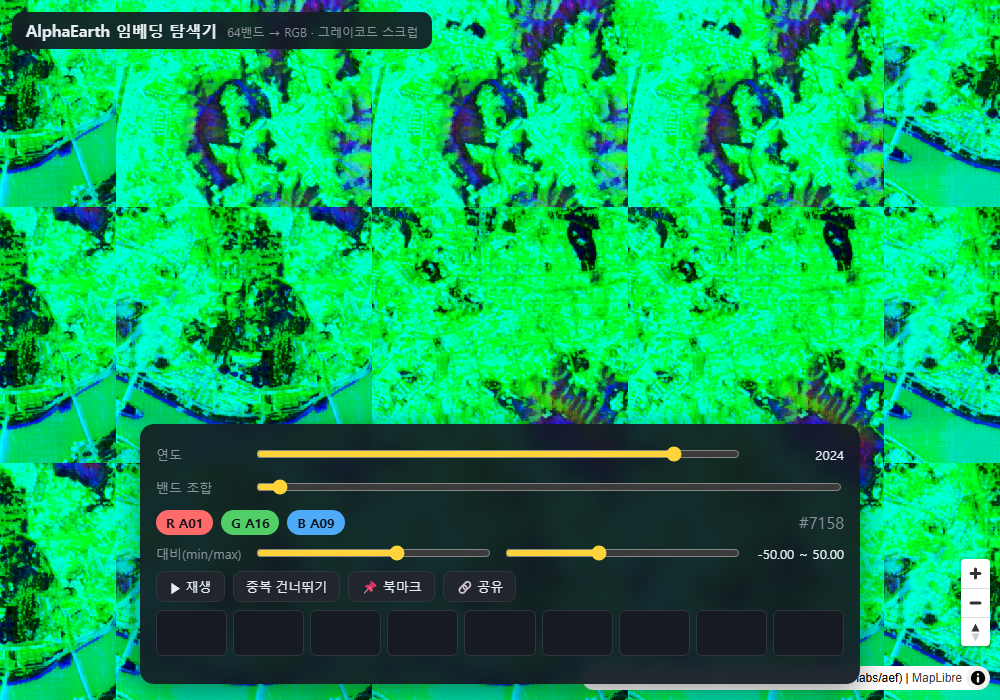

# alphaearth-vis

English | [한국어](README.ko.md)

A browser-based RGB visualizer for the 64-dimensional embeddings of AlphaEarth (Google Satellite Embedding V1) — **no authentication required**. Spin it up locally with a single Docker command (there is no hosted public instance).



> Status: **Working MVP — live browser-verified (Playwright PASS).** Global mosaic tiles + gray-code scrub + tile cache.

Existing tools (geoai/leafmap `add_alphaearth_gui`, the edgeoinnovations viewer) all require Google Earth Engine authentication and a Jupyter environment. This project removes that barrier with **public COGs + a self-hosted tile server**.

## Core idea

Every pixel has 64 bands (A00–A63); pick any 3 to map to R/G/B. Instead of three dropdowns, drag a **single scrub bar** to sweep the 3-channel × 64-band cube (64³ = 262,144) in **reflected gray-code** order. Adjacent frames differ by only ±1 band in one channel, so the map morphs smoothly — it's both a discovery tool and a presentation tool.

```
[Vite + MapLibre GL JS (vanilla ESM)]
   ?scrub=<index>&year=2024&min=-50&max=50
        │  index ↔ (R,G,B) : graycode.js (closed-form, no backend)
        ▼
[FastAPI]
   ├─ /api/tiles?bbox=&year=   : DuckDB query over aef_index.parquet → COG URL list
   └─ /cog, /mosaicjson        : TiTiler dynamic RGB tiles (bidx + rescale)
        ▼
[Public COGs: data.source.coop/tge-labs/aef/v1/annual]  (no auth, free egress, global)
```

## Features

- **Single gray-code scrub** across all 262,144 band combinations; type R/G/B band numbers or the combo index directly.
- **Compare (swipe) mode** — split the map and drag the divider to compare two combos/years side by side.
- **Place & coordinate search** — type a place name (OpenStreetMap / Nominatim) or `lat, lng` to fly there; collapses to a 🔍 icon.
- **Basemap switch** — Dark / Satellite (Esri) / OSM, applied to both compare panes.
- **Embedding opacity** — fade the AlphaEarth layer to blend it with the basemap underneath.
- **Keyboard-editable contrast** — type the min/max rescale values directly, in sync with the sliders.
- **Language toggle** — English / 한국어 (English is the default).
- **Permalink** — view state is serialized into the URL for sharing.

## Data

- Dataset: AlphaEarth Foundations Satellite Embeddings (Source Cooperative `tge-labs/aef`)
- Spatial index: `https://data.source.coop/tge-labs/aef/v1/annual/aef_index.parquet`
- Annual 2017–2025, 10 m resolution, 64 bands, 8192 px UTM tiles, 302,466 total
- Storage: **int8** (−128..127, nodata=−128). EE's float `±0.3` maps to int8 `±38`; empirically `±50` yields the richest detail → default rescale `−50,50`

## Layout

```
backend/   FastAPI + TiTiler + DuckDB index queries
frontend/  Vite + MapLibre + gray-code scrub bar (vanilla ESM)
docs/      design docs
```

## Run

### Docker (recommended — one line)

```bash
docker compose up --build      # → http://localhost:8080
```
(nginx serves the static frontend and proxies `/api` to the backend. The tile cache persists in a named volume.)

> ⚠️ **Intended for local / intranet use.** Before exposing it to the public internet, fix two things: (1) the raw TiTiler at `/cog/*` will render an arbitrary `?url=` COG, so remove that mount or apply a URL allowlist to prevent SSRF; (2) the disk tile cache has no eviction and grows without bound — add a size cap/TTL or put a CDN in front.

### Local development

```bash
# backend
cd backend && python -m venv .venv && .venv/Scripts/activate
pip install -r requirements.txt
uvicorn app.main:app --reload --port 8000

# frontend (separate terminal)
cd frontend && npm install && npm run dev   # vite proxies /api to 8000

# gray-code unit tests (no deps, runs instantly)
node frontend/test/graycode.test.mjs
```

## Verification

- Gray-code: unit-distance / round-trip / bijection tested across all 262,144 frames — PASS
- Index query: validated against the live remote parquet (Seoul / SF / Paris), ~10 ms after load
- Tile render: cold ~30–40 s (remote COG), cache HIT ~5–10 ms
- Browser: Playwright headless PASS (map render + scrub re-render + i18n toggle + coordinate search)
- Docker: both images build + compose stack verified

See [docs/ARCHITECTURE.md](docs/ARCHITECTURE.md) for the full design (Korean).

## License

[MIT](LICENSE)
